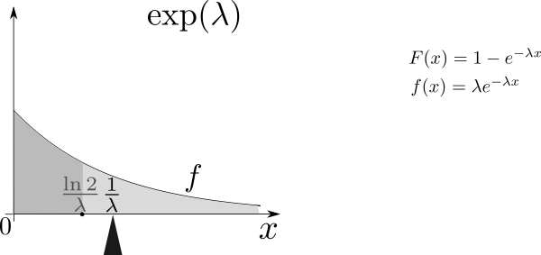

In probability theory and statistics, the **exponential distribution** (a.k.a. negative exponential distribution) is the probability distribution that describes the time between events in a Poisson process, i.e. a process in which events occur continuously and independently at a constant average rate.

The mean of exponential distribution is `1 / lambda` and the standard deviation is also `1 / lambda`.

## Overview

In this project I will investigate the exponential distribution in R and compare it with the Central Limit Theorem, using `lambda = 0.2`.

## Simulations and figures

Let's start taking a look at the **exponential distribution** by obtaining a sample using the `rexp` function. Remember I'll use a lambda value (`rate` parameter) of `0.2` for every simulation included in this report.

```{r}
exp_sample <- rexp(n = 1000, rate = 0.2)
# Let's "spy" the contents of the exp_sample variable.
exp_sample[1:10]
```

Now, let's take a look at the mean of the sample and compare it to the theoretical mean of the distribution.

```{r}
exp_sample_mean <- mean(exp_sample)
```

The mean of the sample is **`r exp_sample_mean`**. As mentioned in the introduction, the theoretical mean of the distribution is `1 / lambda` = `1 / 0.2` = **`r 1 / 0.2`**.

Next, I'll plot the values of the sample to observe their charactertistics. Theoretically, the plot of the sample should look similar to the following graph:



`CC BY-SA 3.0 | File:Mean_exp.svg | Uploaded by Erzbischof | Created: March 12, 2012`

The mean is the **probability mass centre**.

To reduce complexity in the plot functions, I'll create a data frame containing the values of the sample.

```{r}
library(ggplot2)
exp_sample_mean_df <- data.frame(exp_sample)
plot <- ggplot(data = exp_sample_mean_df, aes(exp_sample)) 
plot <- plot + geom_histogram(colour = "black", aes(y =..density.., fill=..count..))
plot <- plot + geom_density(col = 2, size = 1)
plot <- plot + geom_vline(xintercept = mean(exp_sample_mean), size = 2)
plot <- plot + ggtitle(label = "Distribution of the exponential sample")
plot <- plot + labs(x = "Value", y = "Density")
plot <- plot + theme(plot.title = element_text(lineheight = 1, face = "bold"))
plot
```

As it can be noticed, the density line (in red) looks very similar to the previously attached image. The vertical line in black shows how similar is the mean compared to the theoretical mean of the distribution.

### Comparing with CLT

Now that we have explored the exponential distribution, let's investigate the **distribution of averages of 40 exponentials**.

In probability theory, the **central limit theorem (CLT)** states that, given certain conditions, the arithmetic mean of a sufficiently large number of iterates of independent random variables, each with a well-defined expected value and well-defined variance, will be approximately normally distributed, regardless of the underlying distribution.

According to that definition, doing a thousand simulations over the mean of 40 exponentials (note the average of a random variable is itself a random variable and its distribution has an expected value) we should be able to show that the distribution is approximately normal.

```{r}
simulations = 1000
exp_means = NULL
for (i in 1 : simulations) exp_means = c(exp_means, mean(rexp(n = 40, rate = 0.2)))
# Let's "spy" the contents of the exp_means array.
exp_means[1:10]
```

The output of the previous chunk is a subset of 10 of the `exp_means` array that contains the means of 1000 simulations of 40 exponentials.

Let's now use the `exp_means` array to make a plot of the means to see their distribution.

```{r}
exp_means_df <- data.frame(exp_means)
plot <- ggplot(data = exp_means_df, aes(exp_means)) 
plot <- plot + geom_histogram(colour="black", aes(y =..density.., fill=..count..))
plot <- plot + geom_density(col = 2, size = 2)
plot <- plot + geom_vline(xintercept = mean(exp_means), size = 2)
plot <- plot + ggtitle(label = "Distribution of the mean of 40 exponentials")
plot <- plot + labs(x = "Mean", y = "Density")
plot <- plot + theme(plot.title = element_text(lineheight = 1, face = "bold"))
plot
```

As we expected, the distribution looks approximately gaussian (see density line in red). Moreover, the mean of the distribution, whose value is **`r mean(exp_means)`**, is very close to the theoretical mean of the exponential distribution given `lambda = 0.2`
